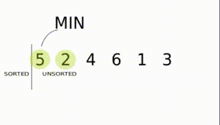
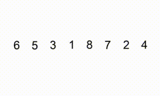
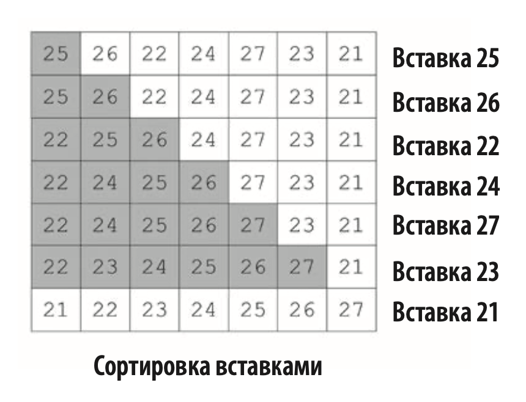
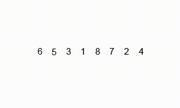
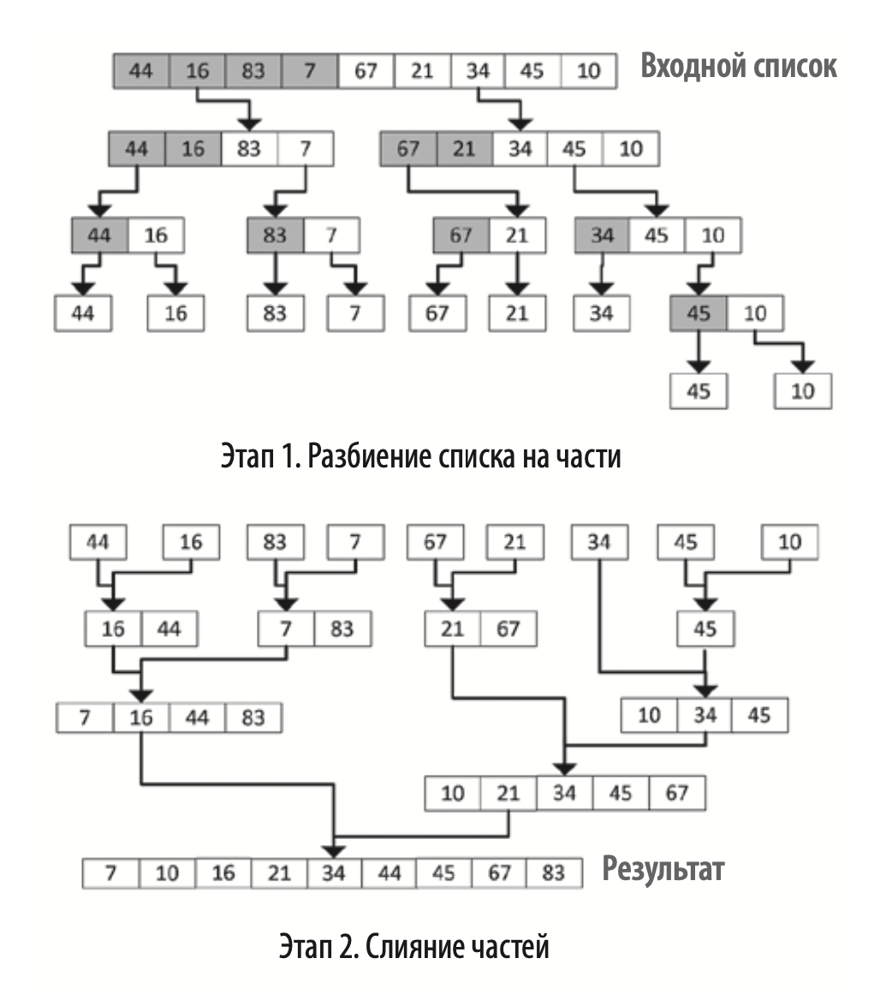

# Алгоритмы на Python

## Сортировка пузырьком


**Сортировка пузырьком (bubble sort)** — это самый̆ простой и медленный̆ алгоритм сортировки. 
Он спроектирован так, что наибольшее значение перемещается вправо по списку на каждой̆ 
итерации цикла. При наихудшем сценарии производительность этого алгоритма равна O(n^2), 
поэтому его следует использовать только для небольших наборов данных.

В основе сортировки пузырьком лежит ряд итераций. Для списка размера N нужно совершить N — 1 проходов.

В процессе сортировки значения соседних элементов сравниваются между собой попарно. 
Если в паре большее значение находится слева, происходит перестановка (обмен). 
Это продолжается до тех пор, пока мы не дойдем до конца списка.


После первой итерации алгоритма наибольшее значение оказывается в конце списка. Затем начинается следующий проход.
Последний элемент не затрагивается, поскольку уже был помещен в нужную позицию на первой итерации.
Его цель — переместить второе по величине значение на предпоследнюю позицию в списке.

Проходы выполняются до тех пор, пока все элементы данных не будут расположены в порядке возрастания. 
Чтобы полностью отсортировать список, алгоритму потребуется N – 1 проходов для списка размером N. 
Полная реализация сортировки пузырьком на Python выглядит следующим образом:

```
def bubble_sort(list):
    lastElementIndex = len(list) - 1
    for passNo in range(lastElementIndex, 0, -1):
        for idx in range(passNo):
            if list[idx] > list[idx + 1]:
                list[idx], list[idx + 1] = list[idx + 1], list[idx]
    return list
```

#### Анализ производительности сортировки пузырьком

Cортировка пузырьком включает в себя два уровня циклов:
* _Внешний цикл_. Совокупность проходов. Например, первый̆ проход — это первая итерация внешнего цикла.
* _Внутренний цикл_. Оставшиеся элементы в списке сортируются до тех пор, пока наибольшее значение не окажется справа. 
На первом проходе будет N – 1 сравнений, на втором — N – 2. На каждом последующем проходе количество сравнений 
будет уменьшаться на единицу.

Из-за двух уровней цикличности наихудшая сложность алгоритма равна O(n^2).


## Сортировка выбором



**Сортировка выбором (selection sort)**  — это улучшенная версия сортировки пузырьком.
С ее помощью мы стараемся минимизировать общее количество обменов значений переменных. За каждый проход выполняется один обмен (сравните с N – 1 в случае сортировки пузырьком).

В этом алгоритме список (или массив) делится на две части: список с отсортированными
элементами и список с элементами, которые только нужно сортировать.
Сначала ищется самый маленький элемент во втором. Он добавляется в конце первого.
Таким образом алгоритм постепенно формирует список от меньшего к большему.
Так происходит до тех пор, пока не будет готовый отсортированный массив.

```
def selection_sort(array):
    for i in range(len(array)-1):
        idx_min = i     # индекс элемента с минимальным значением в "неотсортированном" списке

        for j in range(i + 1, len(array)):
            if array[j] < array[idx_min]:       # если итерируемый элемент меньше
                idx_min = j
        # Помещаем в конец "отсортированного" списка
        array[idx_min], array[i] = array[i], array[idx_min]

    return array
```


#### Анализ производительности сортировки выбором
Наихудшая производительность алгоритма сортировки выбором — O(n^2), ана­логично сортировке пузырьком. Поэтому его не следует использовать для об­ работки больших наборов данных. Тем не менее сортировка выбором — это более продуманный алгоритм, чем сортировка пузырьком, и его средняя произ­водительность лучше из-­за сокращения числа обменов значений.


## Сортировка вставками



Основная идея сортировки вставками заключается в том, что на каждой итерации мы удаляем элемент из имеющейся у нас структуры данных, а затем вставляем его в нужную позицию.

На первой итерации мы сортируем первые два элемента данных. Затем мы расширяем выборку: берем третий элемент и находим для него позицию согласно его значению.

Алгоритм выполняется до тех пор, пока все элементы не будут перемещены в в правильное положение.



В основном цикле мы проходим по всему списку. В каж­дой итерации двумя соседними элементами являются list[j] (текущий элемент) и list[i] (следующий элемент).

В выражениях list [j] > element_next и j >= 0 мы сравниваем текущий элемент со следующим.

```
def insertion_sort(list):
    for i in range(1, len(list)):
        j = i -1        # индекс текущего элемента
        element_next = list[i]      # следующий элемент
        while (list[j] > element_next) and (j >= 0):        # пока текущий элемент больше следующего и индекс текущего больше либо равен нулю
            list[j+1] = list[j]     # меняем местами число, продвигая по списку
            j = j - 1
        list[j+1] = element_next    # вставляем элемент на нужное место
    return list
```

#### Анализ производительности сортировки выбором
Если структура данных уже отсортиро­вана, он выполняется очень быстро. Фактически в этом случае сортировка имеет линейное время выполнения, то есть O(n). 
При наихудшем сценарии каждый внутренний цикл перемещает все элементы в списке. Наихудшая производительность алгоритма сортировки вставками — O(n^2).


## Сортировка слиянием



**Алгоритм сортировки слиянием (merge sort),** разработанный в 1940 году Джоном фон Нейманом. Отличительной чер­той этого алгоритма является тот факт, что его производительность не зависит от упорядоченности входных данных. В его основе лежит стратегия «разделяй и властвуй».

На этапе разделения алгоритм рекурсивно разбивает данные на две части до тех пор, пока размер данных не станет меньше определенного порогового значения. На этапе слияния алгоритм объединяет данные, пока мы не получим оконча­ тельный результат.

Алгоритм состоит из трех шагов:
1. Разделение входного списка на две равные части.
2. Использование рекурсии для разделения до тех пор, пока длина каждого списка не будет равна 1.
3. Наконец, объединение отсортированных частей в список и вывод резуль­тата.




Код реализации алгоритма:

```
def merge_two_list(a, b):
    c = []      # результирующий список
    i = j = 0       # указатели
    while i < len(a) and j < len(b):        # пока указатели меньше длин списков
        # сравниваем элементы двух списков на которые указывают i и j
        # меньший добавляем в результирующий список
        if a[i] < b[j]:
            c.append(a[i])
            i += 1
        else:
            c.append(b[j])
            j += 1

    # добавляем остальные значения, которые остались в большем по длине списке
    if i < len(a):
        c = c + a[i:]
    if j < len(b):
        c = c + b[j:]
    return c


def merge_sort(arr):
    if len(arr) > 1:
        # рекурсивно делим список пополам пока длина списка не будет равно 1
        mid = len(arr) // 2
        left = merge_sort(arr[:mid])
        right = merge_sort(arr[mid:])

        return merge_two_list(left, right)      # слияние двух отсортированных списков
    else:
        return arr

```