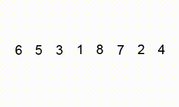
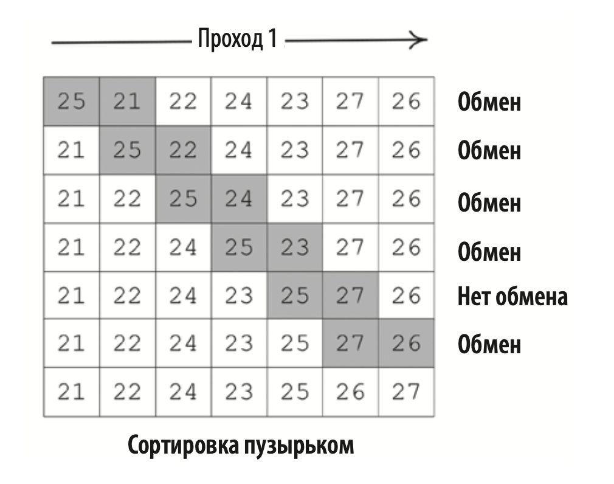

# Алгоритмы на Python

## Сортировка пузырьком



Сортировка пузырьком (bubble sort) — это самый̆ простой и медленный̆ алгоритм сортировки. 
Он спроектирован так, что наибольшее значение перемещается вправо по списку на каждой̆ 
итерации цикла. При наихудшем сценарии производительность этого алгоритма равна O(n2), 
поэтому его следует использовать только для небольших наборов данных.

В основе сортировки пузырьком лежит ряд итераций. Для списка размера N нужно совершить N — 1 проходов.

В процессе сортировки значения соседних элементов сравниваются между собой попарно. 
Если в паре большее значение находится слева, происходит перестановка (обмен). 
Это продолжается до тех пор, пока мы не дойдем до конца списка.



После первой итерации алгоритма наибольшее значение оказывается в конце списка. Затем начинается следующий проход.
Последний элемент не затрагивается, поскольку уже был помещен в нужную позицию на первой итерации.
Его цель — переместить второе по величине значение на предпоследнюю позицию в списке.

Проходы выполняются до тех пор, пока все элементы данных не будут расположены в порядке возрастания. 
Чтобы полностью отсортировать список, алгоритму потребуется N – 1 проходов для списка размером N. 
Полная реализация сортировки пузырьком на Python выглядит следующим образом:

```
def bubble_sort(list):
    lastElementIndex = len(list) - 1
    for passNo in range(lastElementIndex, 0, -1):
        for idx in range(passNo):
            if list[idx] > list[idx + 1]:
                list[idx], list[idx + 1] = list[idx + 1], list[idx]
    return list
```

### Анализ производительности сортировки пузырьком

Cортировка пузырьком включает в себя два уровня циклов:
* _Внешний цикл_. Совокупность проходов. Например, первый̆ проход — это первая итерация внешнего цикла.
* _Внутренний цикл_. Оставшиеся элементы в списке сортируются до тех пор, пока наибольшее значение не окажется справа. 
На первом проходе будет N – 1 сравнений, на втором — N – 2. На каждом последующем проходе количество сравнений 
будет уменьшаться на единицу.

Из-за двух уровней цикличности наихудшая сложность алгоритма равна O(n2).